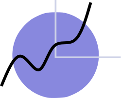

<h1 align="center">FreshTodo</h1> 
<p align="center">A cross-platform app to better manage your todo lists.</p>


<p align="center">
  
</p>


## Motivation
Just too many todo-items(hundreds of items I guess😭) have been stayed on my lists. Without priority of urgency and importance, I often get into devoting my time to something less important.

The tools I am currently using: Microsoft TO-DO and stickyNotes are just not effecient enough.

Wanna a new way to manage my TODO items, sort them by urgency and importance and let it more user-friendly. 

## Feature
- [ ] search items


## Built on
[Qt binding for Go](https://github.com/therecipe/qt)
 
## RoadMap
All in Go.
For specific roadmap, see [here](docs/RoadMap.md)

Also going to implement a FP version.
Make a goal here, should start the FP version before 1st, Nov.

Hoping to try [fluent design](https://www.microsoft.com/design/fluent/) as GUI part.```:)```

## Goal 
Before 15th, Oct, 2018 -- a simple version I can add, delete and move easily in four quadrants divided by two axis of importance and urgency.

